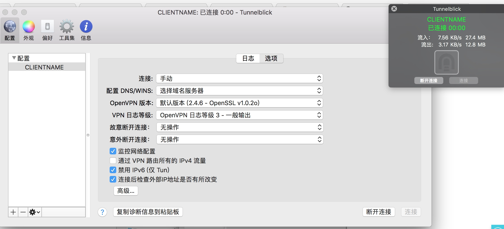
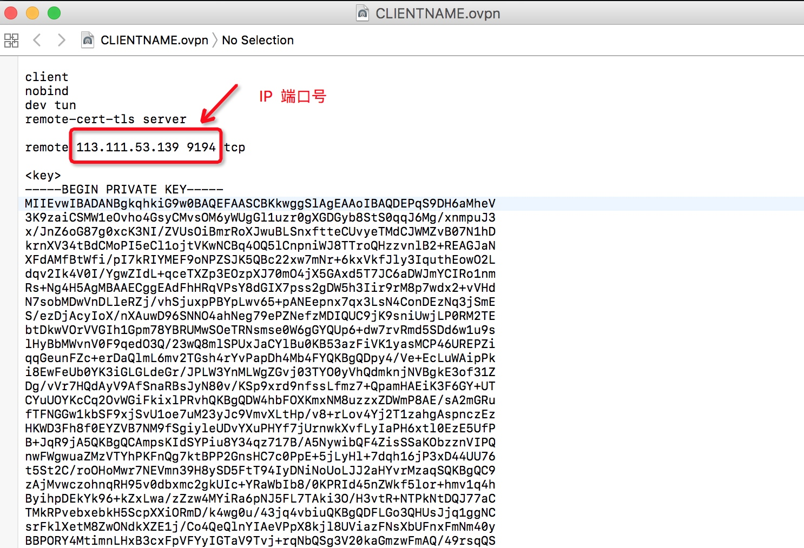
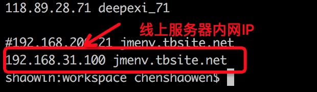
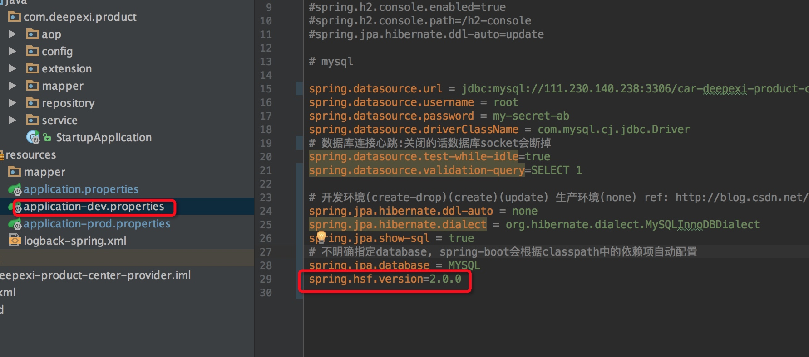
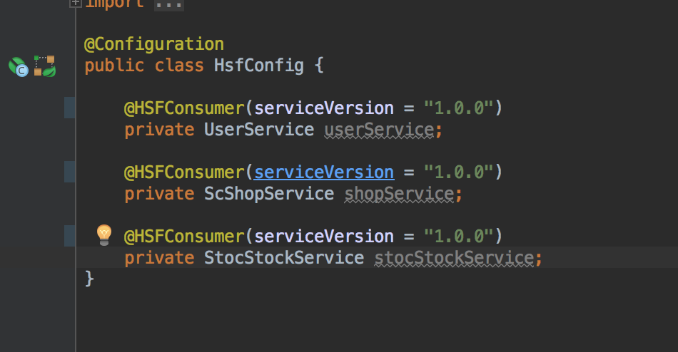
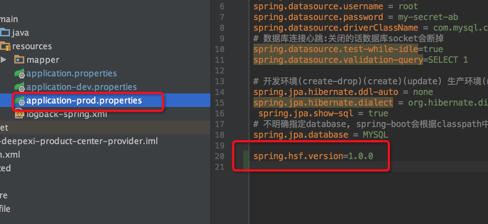
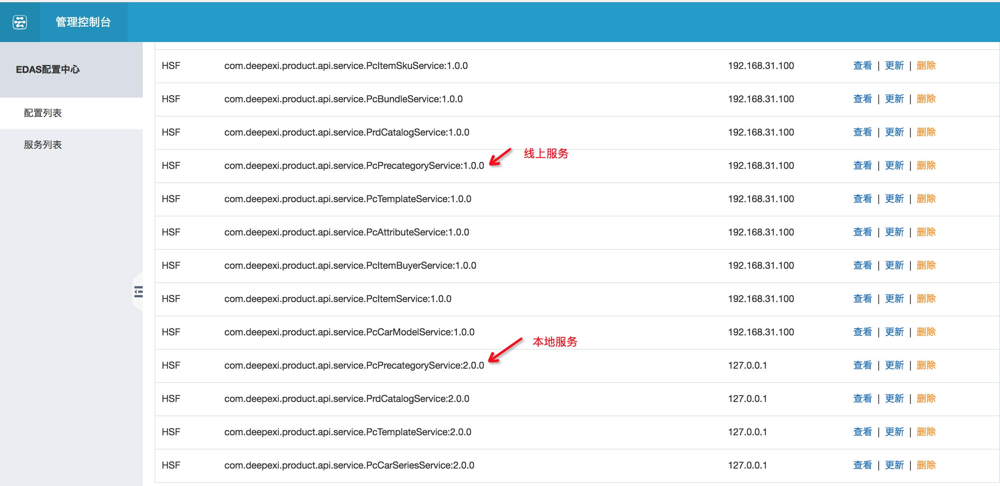

# HSF本地RPC调用线上服务

在实际的开发过程中，会存在一个服务需要RPC调用其他的各个服务，当调用的服务比较多时，若不能直接调用线上部署的服务（以前），开发调试将变成一件遥不可及的事情。出于安全性的考虑，HSF框架发布的服务只注册内网IP到注册中心，因此，下面介绍如何连接线上服务进行本地开发。

## 实现原理

根据参考中的[通过 VPN 在本地调试 RPC 服务](https://help.aliyun.com/document_detail/87549.html?spm=a2c4g.11186623.6.668.27584a41iNHg1B)的描述，本地连接线上服务调试的实现，原理就是服务器上搭建一个vpn，生成密钥，客户端启动vpn，带上密钥访问线上服务。

## 快速开始

- 线上服务器生成密钥(证书)

参考[通过 VPN 在本地调试 RPC 服务](https://help.aliyun.com/document_detail/87549.html?spm=a2c4g.11186623.6.668.27584a41iNHg1B) 的**步骤1~5**，得到**CLIENTNAME.ovpn**配置文件,下载到本地

- 线上服务器搭建vpn

参考[通过 VPN 在本地调试 RPC 服务](https://help.aliyun.com/document_detail/87549.html?spm=a2c4g.11186623.6.668.27584a41iNHg1B) 的**步骤6**

由于内网服务器无法暴露1194端口，因此实际部署时改用9194端口暴露


- 本地开发环境安装vpn客户端

参考[通过 VPN 在本地调试 RPC 服务](https://help.aliyun.com/document_detail/87549.html?spm=a2c4g.11186623.6.668.27584a41iNHg1B) 的**在本地开发人员 PC 上配置 OpenVPN 客户端**

- 使用密钥连接vpn服务端

把**CLIENTNAME.ovpn**配置文件添加到vpn客户端，进行vpn连接(**mac**版直接拖拽文件到左边方框)



注意：若线上服务器IP和vpn端口号发生变化，可以更改**CLIENTNAME.ovpn**配置文件进行重新连接


编辑后重新拖拽到客户端进行重连即可

- 本地开发连接线上配置中心调用服务（配置内网ip）

1.查看线上服务器内网IP地址

```
192.168.31.100
```

2.更改jmenv.tbsite.net指向地址



3.更改本地服务版本号

**由于目前HSF并不提供类似Dubbo的register=false（只消费不注册）的功能，因此为了不影响线上服务的相互调用，可以通过本地开发环境更改服务版本的方式实现**



全局配置dev环境服务版本为2.0.0，消费者统一配置版本为1.0.0



全局配置生产环境不受影响



4.启动本地hsf服务

5.通过内网IP访问线上注册中心

访问：http://192.168.31.100:8080/

互不影响

## 参考

- [通过 VPN 在本地调试 RPC 服务](https://help.aliyun.com/document_detail/87549.html?spm=a2c4g.11186623.6.668.27584a41iNHg1B)
